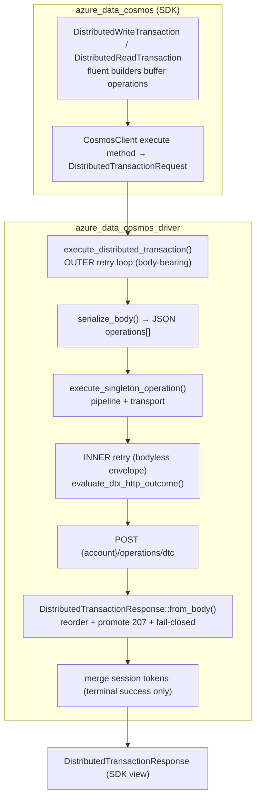
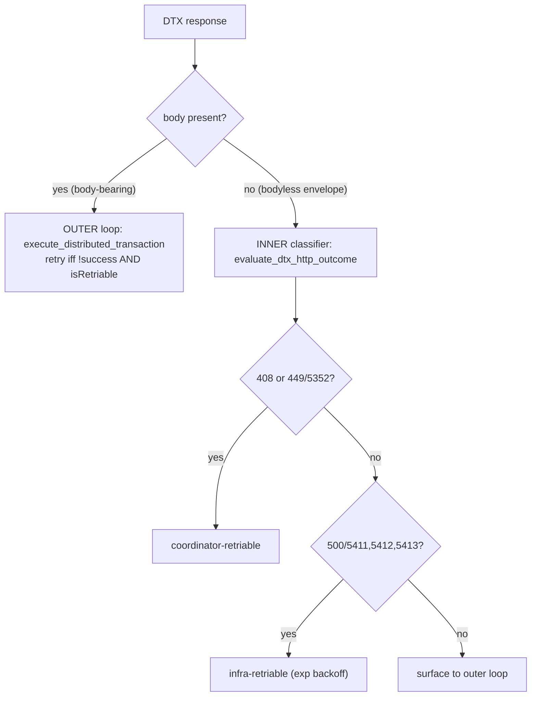

# Distributed Transactions (DTX) Spec — Rust Driver & SDK

**Status:** Draft / Preview (feature-gated, not production-ready)
**Date:** 2026-07-06
**Authors:** (team)
**Crates:** `azure_data_cosmos_driver` (transport, models, retry), `azure_data_cosmos` (public SDK surface)
**Feature gate:** `preview_dtx` (disabled by default)

---

## Table of Contents

1. [Goals & Motivation](#1-goals--motivation)
2. [Scope & Feature Gating](#2-scope--feature-gating)
3. [Architectural Overview](#3-architectural-overview)
4. [Public API Surface](#4-public-api-surface)
5. [Wire Contract — `POST /operations/dtc`](#5-wire-contract--post-operationsdtc)
6. [Response Model & Status Promotion](#6-response-model--status-promotion)
7. [Retry Architecture](#7-retry-architecture)
8. [Session-Token Handling](#8-session-token-handling)
9. [In-Memory Emulator Fidelity](#9-in-memory-emulator-fidelity)
10. [Architecture Decision Records](#10-architecture-decision-records)
11. [Test Coverage](#11-test-coverage)
12. [Known Limitations & Open Questions](#12-known-limitations--open-questions)
13. [References](#13-references)

---

## 1. Goals & Motivation

### Problem statement

`TransactionalBatch` provides ACID semantics for up to 100 operations sharing a
single partition key inside a single container. Within that boundary, reads and
queries observe the batch atomically: callers do not see a partially committed
batch state. The limitation is scope. `TransactionalBatch` cannot span partition
keys or containers.

The **Distributed Transaction (DTX)** API extends Cosmos DB write atomicity beyond
that single-partition boundary: a `DistributedWriteTransaction` commits or aborts
**multi-partition, multi-container** writes within the same account, coordinated
server-side by the **Distributed Transactions Coordinator (DTC)**. Cross-partition
snapshot reads are a separate DTX operation shape: callers must use
`DistributedReadTransaction`, which supports transactional **point reads** only.
Ordinary reads and queries outside `DistributedReadTransaction` are not part of
the DTC snapshot protocol; in particular, queries can observe an intermediate view
while a distributed write transaction is still committing across participants.
Applications that need a cross-partition read with transactional consistency must
use DTX transactional point reads and cannot rely on query isolation for that purpose.

This document specifies how the Rust driver and SDK implement the client half of
that contract: request construction, the `POST /operations/dtc` wire shape,
response aggregation and status promotion, the two-tier retry model, session-token
bookkeeping, and the in-memory emulator that mirrors coordinator behavior for
offline testing.

### Design principles

- **Wire compatibility first.** The Rust client is bug-for-bug compatible with the
  .NET v3 SDK's DTC wire contract (PR #6002). The request/response JSON shape,
  header names, status-code promotion, and retry budgets all match .NET so a
  single backend coordinator serves both clients identically.
- **Atomic writes, explicit snapshot reads.** A write transaction either commits
  every operation or aborts every operation. Snapshot isolation for cross-partition
  reads is provided only by `DistributedReadTransaction` point reads, not by
  ordinary queries.
- **Fail closed.** An ambiguous or malformed coordinator response is never surfaced
  as success. When in doubt, the client synthesizes a `500` so callers retry or
  reconcile rather than trust partial data.
- **Preview isolation.** The entire feature compiles out unless `preview_dtx` is
  enabled, so no DTX surface leaks into the stable API or default builds.

---

## 2. Scope & Feature Gating

| Concern               | Decision                                                                                                  |
| --------------------- | --------------------------------------------------------------------------------------------------------- |
| Feature flag (driver) | `preview_dtx` — gates all DTX models, serialization, retry logic, and the emulator handler.               |
| Feature flag (SDK)    | `preview_dtx` — enables `azure_data_cosmos_driver/preview_dtx` transitively and exposes the SDK builders. |
| Emulator tests        | require `__internal_in_memory_emulator preview_dtx`.                                                      |
| Connectivity mode     | Gateway only. Direct mode is out of scope.                                                                |
| Account scope         | Same-account only. Cross-account transactions are not supported.                                          |
| Encoding              | JSON only in both directions. No HybridRow / binary encoding.                                             |
| Stability             | **Not production-ready.** APIs may change without notice while `preview_dtx` remains off by default.      |

> The `preview_dtx` gate is deliberately coarse: it wraps public types, the driver
> `execute_distributed_transaction` entry point, the pipeline retry classifiers,
> and the emulator `/operations/dtc` handler as a single unit so partial builds
> cannot compile a half-wired feature.

---

## 3. Architectural Overview

A distributed transaction is a **single logical request** that carries many buffered
operations. Unlike ordinary point operations (which the driver routes per partition),
the whole DTX request is sent to the account's DTC endpoint and the coordinator fans
out internally.



Two distinct retry tiers cooperate (see [§7](#7-retry-architecture)):

- The **outer loop** in `execute_distributed_transaction` retries **body-bearing**
  coordinator responses the coordinator itself marks retriable (`isRetriable: true`).
- The **inner classifier** in the transport pipeline retries **bodyless** envelope
  failures (`408`, specific `449`/`500` sub-statuses) that never reached the
  coordinator's transaction logic.

---

## 4. Public API Surface

### 4.1 SDK builders (`azure_data_cosmos`)

Transaction documents mirror `TransactionalBatch`: callers prepare a data-only
transaction and pass it to the account client for execution:

```rust no_run
// Feature: preview_dtx
let write_tx = DistributedWriteTransaction::new()
    .create_item(&container_a, "tenant-1", "item-1", item_1, None)?
    .delete_item(&container_b, "tenant-2", "item-2", None);

let response = client.commit_distributed_write(write_tx).await?;

let read_tx = DistributedReadTransaction::new()
    .read_item(&container_a, "tenant-1", "item-1", None)
    .read_item(&container_b, "tenant-2", "item-2", None);

let response = client.execute_distributed_read(read_tx).await?;
```

Each operation method takes a `&ContainerClient` for the target container. The
SDK resolves the underlying driver `ContainerReference` internally; callers do
not use `ContainerReference` when building SDK distributed transactions. The
same-account check runs when `CosmosClient` executes the prepared transaction.

`DistributedWriteTransaction` buffers write operations with a fluent builder and
commits them atomically:

| Method                            | Purpose                                              |
| --------------------------------- | ---------------------------------------------------- |
| `create_item<T: Serialize>(...)`  | Buffer a create.                                     |
| `replace_item<T: Serialize>(...)` | Buffer a replace.                                    |
| `upsert_item<T: Serialize>(...)`  | Buffer an upsert.                                    |
| `delete_item(...)`                | Buffer a delete.                                     |
| `patch_item(...)`                 | Buffer a patch (optionally with a filter predicate). |

`CosmosClient::commit_distributed_write(...)` executes all buffered writes as one
atomic unit and returns a `DistributedTransactionResponse`.

`DistributedReadTransaction` buffers point reads that execute under a consistent
cross-partition snapshot:

| Method           | Purpose              |
| ---------------- | -------------------- |
| `read_item(...)` | Buffer a point read. |

`CosmosClient::execute_distributed_read(...)` executes all buffered reads under
snapshot isolation and returns a `DistributedTransactionResponse`.

Per-operation options:

- `DistributedTransactionOperationOptions` — carries the per-operation ETag
  precondition and per-operation session token.
- `DistributedTransactionPatchOperationOptions::with_filter_predicate(...)` — the
  server-side conditional-PATCH SQL predicate.

### 4.2 Response accessors

`DistributedTransactionResponse` exposes:

- `status()` / `is_success_status_code()` — the promoted envelope status.
- `idempotency_token()` — the `Uuid` reused across internal retries (observability
  and correlation only).
- `is_retriable()` — the coordinator's retriable hint.
- `error_message()` / `diagnostic_string()` — synthesized and coordinator-side
  diagnostics.
- `diagnostics()` — client-side `DiagnosticsContext` covering the full retry loop.
- Per-operation results (`DistributedTransactionOperationResult<'a>`): `index`,
  `status_code`, `sub_status_code`, `etag`, `session_token`,
  `partition_key_range_id`, `request_charge`, and the resource body for reads.

### 4.3 Driver model types

The driver exposes the wire models directly (used by the emulator comparison tests
and any lower-level consumer):

- `DistributedTransactionType` — `Write` | `Read`.
- `DistributedTransactionOperationKind` — `Create`, `Read`, `Replace`, `Upsert`,
  `Delete`, `Patch`.
- `DistributedTransactionTarget` — resolved `(container, partition_key, id)`.
- `DistributedTransactionOperation` — kind + target + optional body / session token /
  precondition / patch predicate.
- `DistributedTransactionRequest` — transaction type + operations + a fresh
  `idempotency_token`.
- `DistributedTransactionResponse` / `DistributedTransactionOperationResult`.

---

## 5. Wire Contract — `POST /operations/dtc`

### 5.1 Endpoint & request headers

The request targets `POST {account}/operations/dtc`.

| Header                          | Value                                                        |
| ------------------------------- | ------------------------------------------------------------ |
| `x-ms-cosmos-idempotency-token` | Request `idempotency_token` (`Uuid`), stable across retries. |
| `x-ms-cosmos-operation-type`    | `CommitDistributedTransaction` (write) or `Read` (read).     |
| `x-ms-cosmos-resource-type`     | `DistributedTransactionBatch`.                               |

`ResourceType::DistributedTransactionBatch` is what routes the request to the DTX
retry classifier in the pipeline and marks the operation body-bearing for throttle
handling.

### 5.2 Request body

`DistributedTransactionRequest::serialize_body()` emits the .NET-compatible shape:

```json
{
  "operations": [
    {
      "databaseName": "banking",
      "collectionName": "accounts",
      "id": "account-A",
      "collectionResourceId": "<coll rid>",
      "databaseResourceId": "<db rid>",
      "partitionKey": ["account-A"],
      "index": 0,
      "resourceBody": { "id": "account-A", "balance": 900 },
      "sessionToken": "0:1#9#4=8",
      "ifMatch": "\"etag\"",
      "operationType": "Create",
      "resourceType": "Document"
    }
  ]
}
```

Serialization rules:

- `index` is the zero-based position; the coordinator may return results out of order
  and the client reorders by this field.
- `resourceBody` is omitted for `Read`/`Delete` and included (as raw JSON) otherwise.
- An empty/whitespace `sessionToken` is omitted rather than sent blank.
- Preconditions serialize to `ifMatch` / `ifNoneMatch`.
- For `Patch` with a filter predicate, the predicate is injected as a `condition`
  field **inside** `resourceBody` (matching the .NET conditional-patch shape); the
  body must be a JSON object or serialization fails with `400`.

### 5.3 Status-code families

| Transaction     | Envelope statuses                                                          |
| --------------- | -------------------------------------------------------------------------- |
| Write (commit)  | `200` commit · `452` abort · `449` · `408` · `429` · `400` · `403` · `500` |
| Read (snapshot) | `200` · `304` · `207` · `404` · `449` · `408`                              |

DTX-specific sub-status codes:

| Status / sub   | Name                         | Meaning                                                           |
| -------------- | ---------------------------- | ----------------------------------------------------------------- |
| `453` / `5415` | `DtcOperationRolledBack`     | A prepared (voted-Yes) write op that was rolled back by an abort. |
| `449` / `5352` | `DtcCoordinatorRaceConflict` | Coordinator race; bodyless-retriable.                             |
| `500` / `5411` | `DtcLedgerFailure`           | Infra failure; bodyless-retriable.                                |
| `500` / `5412` | `DtcAccountConfigFailure`    | Infra failure; bodyless-retriable.                                |
| `500` / `5413` | `DtcDispatchFailure`         | Infra failure; bodyless-retriable.                                |

---

## 6. Response Model & Status Promotion

`DistributedTransactionResponse::from_body(status, sub_status, body, operation_count, idempotency_token)`
turns a coordinator response into the client model. The order of operations is:

1. **Empty / malformed body.** If the body is empty or not valid JSON, or lacks a
   valid `operationResponses` array, the parser either **fails closed to `500`**
   (when the envelope was a success) or **pads** each operation with the envelope
   status (when the envelope was already a failure). This guarantees a success
   envelope is never returned with unparseable per-operation data.
2. **Per-operation parse.** Each entry is retained as a raw JSON object and also
   parsed into typed accessors for `index`, `statusCode`, `subStatusCode`, `etag`,
   `sessionToken`, `partitionKeyRangeId`, `requestCharge`, and `resourceBody`.
   Successful write transaction operation responses do not carry `resourceBody`;
   successful read transaction operation responses carry the read item body. Any
   parse error or a count mismatch triggers the same fail-closed / padded fallback.
3. **Reorder by `index`.** Results are placed into request order. A duplicate or
   out-of-range index is treated as malformed (fail-closed / padded).
4. **`207` promotion (request order).** If the envelope is `207 MultiStatus`, the
   status is promoted to the **first per-operation status `>= 400` that is not `424`**
   in **request order** (i.e. after reordering), matching .NET (PR #5974). `424
   FailedDependency` is neutral and never promoted.

The parsed response also carries the raw parsed response headers, `is_retriable`,
`diagnostic_string`, and (attached by the driver) `activity_id`, `request_charge`,
`retry_after_ms`, and `diagnostics`.

### 6.1 Aggregate status model (read transactions)

A read transaction produces a **confirmed snapshot only when every read observed
committed data**:

- **All success** → envelope promotes the distinct per-op codes: all `200` → `200`,
  all `304` → `304`, mixed distinct → `207`.
- **Any failure** → every individually-successful read is rewritten to
  `424 FailedDependency` with its body stripped (it never contributed to a snapshot),
  and the surviving distinct non-`424` codes promote the envelope: a single distinct
  code surfaces as-is (e.g. `404`), two or more become `207`.

### 6.2 Aggregate status model (write transactions)

- **Commit** → `200` envelope; each operation reports its own `2xx` (e.g. `201`
  create).
- **Abort** → `452` envelope. The operation(s) that voted "No" keep their real
  failure code (e.g. `409`/`404`); every operation that voted "Yes" (was prepared)
  is rewritten to `453` sub-status `5415` (`DtcOperationRolledBack`).

---

## 7. Retry Architecture

DTX uses **two cooperating retry tiers**. The determining factor is whether the
coordinator response carries a **body**.



### 7.1 Outer loop (body-bearing)

`execute_distributed_transaction` owns the outer loop. A response is retried only
when it is **not** a success envelope **and** the coordinator set `isRetriable: true`.
The whole request is safe to replay because `OperationType::is_idempotent` returns
`true` for both `CommitDistributedTransaction` and `ReadDistributedTransaction`, and
the `idempotency_token` is generated once and reused on every attempt so the
coordinator can dedupe.

| Parameter                        | Value                                                        |
| -------------------------------- | ------------------------------------------------------------ |
| `DTX_OUTER_MAX_RETRIES`          | 10                                                           |
| `DTX_OUTER_MAX_CUMULATIVE_DELAY` | 30 s                                                         |
| `DTX_OUTER_BASE_DELAY`           | 1 s                                                          |
| `DTX_OUTER_MAX_EXPONENT`         | 5                                                            |
| `DTX_OUTER_JITTER_RATIO`         | ±25 %                                                        |
| Server hint                      | `max(computed, retry-after)` — honors `x-ms-retry-after-ms`. |

### 7.2 Inner classifier (bodyless envelope)

For `ResourceType::DistributedTransactionBatch`, the pipeline routes to
`evaluate_dtx_http_outcome`. It only acts when the response body is **empty** — a
bodyless envelope means the request failed in transport / dispatch before the
coordinator produced a transaction result, so replay is safe. Two classes:

| Class                 | Trigger                                     | Budget                             | Backoff                                                                                               |
| --------------------- | ------------------------------------------- | ---------------------------------- | ----------------------------------------------------------------------------------------------------- |
| Coordinator-retriable | `408 RequestTimeout`, or `449` + sub `5352` | `MAX_DTX_COORDINATOR_RETRIES` = 10 | server `retry-after` or `DTX_COORDINATOR_RETRY_INTERVAL` = 1 s                                        |
| Infra-retriable       | `500` + sub `5411` / `5412` / `5413`        | `MAX_DTX_INFRA_RETRIES` = 9        | exponential `DTX_INFRA_BASE_BACKOFF` 100 ms → `DTX_INFRA_MAX_BACKOFF` 5 s, `DTX_INFRA_MAX_EXPONENT` 6 |

These counters live on `OperationRetryState`
(`dtx_coordinator_retry_count` / `dtx_infra_retry_count`) and drive the
`OperationAction::DtxRetry { new_state, delay }` action. A **body-bearing** `408` /
`449` / `500` is left for the coordinator's `isRetriable` signal to govern via the
outer loop — the inner tier deliberately does not swallow it.

### 7.3 Throttling (`429`)

- **Body-bearing** DTX `429` is **not** eligible for the shared transport throttle
  retry; it bubbles to the outer loop where the coordinator's `isRetriable` +
  `retry-after` govern.
- **Bodyless** DTX `429` uses the shared throttle path like any other request.

> **Interaction with the user-configured throttle cap.** Because a body-bearing
> DTX `429` is routed to the outer coordinator loop rather than the shared
> throttle path, the user-configurable throttle cap
> (`ThrottlingRetryOptions::max_retry_count` / `max_retry_wait_time`) does **not**
> bound it — including a `max_retry_count = 0` "fail fast" setting. Body-bearing
> DTX `429`s are instead bounded by the DTX outer-loop budget
> (`DTX_OUTER_MAX_RETRIES` / `DTX_OUTER_MAX_CUMULATIVE_DELAY`) and the operation's
> end-to-end deadline. Only **bodyless** DTX `429`s honor the shared throttle cap.

### 7.4 Cross-cutting recovery handlers

A DTX response flows through the shared pipeline classifier
(`evaluate_http_outcome`) before reaching the DTX-specific tiers, so a subset of
the normal recovery handlers still applies:

- **`403/3` WriteForbidden** and **`403/1008` DatabaseAccountNotFound** run
  *before* the DTX classification. Both are topology-divergence signals that
  refresh account properties and fail over, and they apply to every operation
  type including writes (PR #4590). A DTX request therefore still recovers from a
  stale write-region / account-topology view instead of surfacing the raw `403`.
- **`404/1002` ReadSessionNotAvailable**, the generic retry-trigger group
  (`503` / `410` Gone / bodyless `408`), and the `5xx`-read handler are
  intentionally **bypassed** for DTX. Blindly failing a write over to another
  region is unsafe (PR #4432), and the coordinator mediates routing and
  read-snapshot consistency itself. As a consequence a DTX **read** does not get
  the session-lag retry / region-advance a normal read would on `404/1002`; it
  surfaces the coordinator's status to the caller (who reconciles). This is an
  intentional asymmetry from the normal point-operation path.

---

## 8. Session-Token Handling

Before serialization, when Session consistency is effective, each operation that
does not already carry a caller-supplied session token is stamped from the session
container. The driver resolves the operation's partition key range through the
PKRange cache, prefers an exact range token, walks parent range tokens for freshly
split children, and falls back to the compound collection-level token when the
range cannot be resolved. This mirrors .NET PR #5958's best-effort
`ResolvePartitionLocalToken` behavior.

After a **terminal success** (the outer loop returning `Ok`), the driver calls
`merge_distributed_transaction_session_tokens`. Because a distributed transaction
spans partitions, tokens are **per operation**, keyed by the operation's
`partitionKeyRangeId`. The merge:

- Assembles split tokens (LSN plus a separate `partitionKeyRangeId`) into the
  `{pkRangeId}:{lsn}` form before folding them into the session container.
- Models per-region progress as `region_progress: HashMap<u64, Option<u64>>`,
  where `None` is the wire "no-progress" sentinel (`-1`) and `Some(lsn)` a
  recorded region LSN, so tokens such as `0#3#12=-1` parse and round-trip
  correctly (`None` sorts below any `Some` in recency/merge comparisons).
- Under **Session** consistency, a non-canonical token — a corrupt value, **or**
  a bare `{lsn}` that has no interior colon and no `partitionKeyRangeId` to route
  it to a partition — is **rejected strictly** (the committed response fails
  closed) so it cannot silently weaken read-your-own-writes. Outside Session
  consistency the bookkeeping is best-effort.

Session merge runs **only on terminal success**. Outside Session consistency,
token bookkeeping is best-effort and does not fail the response. Under Session
consistency, a malformed per-operation token on a committed response is surfaced
as an error (matching .NET PR #5958) so read-your-own-writes is not silently
weakened.

---

## 9. In-Memory Emulator Fidelity

The driver ships an in-memory emulator (`__internal_in_memory_emulator`) that serves
`POST /operations/dtc` so DTX can be exercised offline and dual-compared against a
live DTC account. The handler mirrors coordinator semantics:

- **Transaction-type inference.** The handler infers the type from the operations
  (all `Read` → read path; any write → write path) rather than threading the
  `x-ms-cosmos-operation-type` header, keeping the emulator self-contained.
- **Write = two-phase commit.**
  - *Prepare*: every operation is validated and votes. Any "No" vote aborts the whole
    transaction before any mutation — `452` envelope, No-voters keep their code,
    Yes-voters become `453`/`5415`.
  - *Commit*: each write captures a pre-image, then applies. A runtime failure
    (e.g. throttling) restores every already-applied mutation in reverse order,
    preserving all-or-nothing semantics.
- **Read = snapshot rewrite.** All-success reads promote `200`/`304`/`207`; on any
  failure, individually-successful reads are rewritten to `424` (body stripped) and
  the surviving distinct codes promote the envelope (single → that code, `>=2` → `207`).
  `isRetriable` is set only for a `449` envelope.

The emulator's committed happy-path wire shape (envelope `200`, per-op codes, session
tokens, bodies) is byte-compatible with the live coordinator, which is what lets the
dual-backend comparison test assert parity.

---

## 10. Architecture Decision Records

Each ADR records a decision, its context, the consequences, and the alternatives
considered. Entries are append-only; superseded entries are marked, not deleted.

- ADR-001 — Ship DTX behind a disabled-by-default `preview_dtx` feature: `adr/001_ship_preview_feature.md`
- ADR-002 — Match the .NET v3 JSON wire contract exactly: `adr/002_match_wire_contract.md`
- ADR-003 — Split body-bearing and bodyless retry tiers: `adr/003_split_retry_tiers.md`
- ADR-004 — Fail closed on ambiguous coordinator responses: `adr/004_fail_ambiguous_responses.md`
- ADR-005 — Promote `207` in request order: `adr/005_promote_multistatus.md`
- ADR-006 — Generate and reuse idempotency tokens: `adr/006_generate_idempotency_token.md`
- ADR-007 — Merge per-operation session tokens strictly: `adr/007_merge_session_tokens.md`
- ADR-008 — Implement emulator rollback fidelity: `adr/008_implement_emulator_rollback.md`
- ADR-009 — Keep outer retry in the driver: `adr/009_keep_retry_driver.md`
- ADR-010 — Limit preview scope: `adr/010_limit_preview_scope.md`
- ADR-011 — Route distributed transactions through account write regions: `adr/011_route_transactions.md`

---

## 11. Test Coverage

| Layer                   | Tests                                                                                                                                                                                                                                                                                                                              |
| ----------------------- | ---------------------------------------------------------------------------------------------------------------------------------------------------------------------------------------------------------------------------------------------------------------------------------------------------------------------------------- |
| Driver unit (models)    | `serialize_create_operation`, `serialize_read_omits_body_and_empty_session_token`, `serialize_patch_adds_condition`, `parse_out_of_order_results_reorders_by_index`, `parse_duplicate_index_success_fails_closed`, `parse_duplicate_index_error_pads_with_envelope_status`, `parse_multistatus_promotes_wire_order_then_reorders`. |
| Driver unit (operation) | `distributed_write_transaction_is_idempotent`, `distributed_read_transaction_is_read_only_and_idempotent`.                                                                                                                                                                                                                         |
| Emulator integration    | `dtx_create_then_read`, `dtx_failed_write_does_not_partially_commit` (asserts `452` envelope + `453`/`5415` siblings + no partial commit), `dtx_read_snapshot_failure_rewrites_successful_reads` (asserts `424` rewrite + `404` envelope).                                                                                         |
| Dual-backend            | `dtx_create_read_matches_live_account` (ignored) — runs single- and multi-container create/read against the emulator and, when a DTX-enabled account is configured, compares emulator vs. live snapshots.                                                                                                                          |

Run the driver DTX suites with:

```pwsh
cargo test -p azure_data_cosmos_driver --lib --features preview_dtx distributed
cargo test -p azure_data_cosmos_driver --test in_memory_emulator --features "__internal_in_memory_emulator preview_dtx" dtx_
```

---

## 12. Known Limitations & Open Questions

Aligned with the .NET API review (PR #5877 §12–13):

1. **No abort/rollback API** — commit-only by design; abandon by not committing.
2. **No read-within-write** — atomic read-modify-write needs separate transactions.
3. **No caller-supplied idempotency token** — no cross-restart exactly-once; reconcile
   on unknown outcomes.
4. **Operation-count cap** — not documented or enforced client-side.
5. **Gateway-only, same-account, JSON-only** — no Direct mode, cross-account, or
   binary encoding.
6. **`SubStatusCode` visibility** — DTC sub-statuses (`5352`, `5411`–`5413`, `5415`)
   are internal constants; whether to surface a public enum is open.

---

## 13. References

- **Wire contract — PR #6002** ("Docs: Add Distributed Transactions REST wire
  contract"): authoritative I/O contract between `CosmosClient` and the Distributed
  Transactions Coordinator — request/response headers, request payloads, the
  read-transaction aggregate status model, and the `408` / `429` / `449` retry
  policies. <https://github.com/Azure/azure-cosmos-dotnet-v3/pull/6002>
- **API review / open spec — PR #5877** ("Docs: Adds distributed transactions API
  review document", `docs/distributed-transactions-api-review.md`): the .NET public
  API surface, type hierarchy, idempotency & single-use contract, session
  consistency, error behavior, and open questions.
  <https://github.com/Azure/azure-cosmos-dotnet-v3/pull/5877/files>
- Related driver specs:
  `../TRANSPORT_PIPELINE_SPEC.md`,
  `../ErrorCodesAndRetries.md`, and
  `../PATCH_HANDLER_SPEC.md`.

---

**Last Updated:** 2026-07-06
