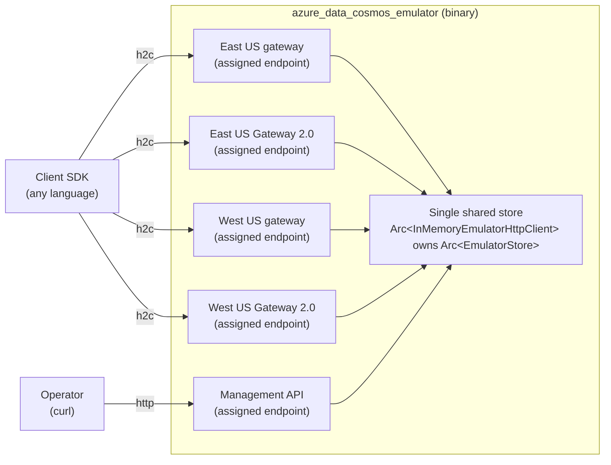

# Hosted In-Memory Cosmos DB Emulator — Plan & Summary

**Status:** Draft / Plan (not yet implemented)
**Date:** 2026-07-14
**Crates:** `azure_data_cosmos_emulator` (new binary host), `azure_data_cosmos_driver` (emulator core, behind a feature)
**Feature gate:** `__internal_in_memory_emulator` (non-SemVer emulator surface)

---

## Table of Contents

1. Goals & Motivation
2. Scope, Phasing & Feature Gating
3. Architecture Overview
4. Configuration File
5. Data-Plane Hosting (Gateway V1 & Gateway 2.0)
6. Management REST API (Control Plane)
7. Rust Public API Surface
8. HTTP/2 & Transport Notes
9. CI Integration
10. Authentication & HTTPS (Deferred)
11. Architecture Decision Records
12. Open Questions & Future Work
13. References

---

## 1. Goals & Motivation

The in-memory Cosmos DB emulator lives in `azure_data_cosmos_driver` and today can only be
injected **in-process** as an `HttpClient` for Rust-internal tests. It intercepts requests at
the `azure_core::http::HttpClient` boundary, so the whole operation pipeline (routing, session
management, retry, failover) executes normally while HTTP I/O is replaced by a deterministic
in-memory store.

The goal of this work is to make the same emulator usable by **other language SDKs** (and by
any client) by hosting it **behind real network ports over HTTP/2**, without moving the
emulator implementation out of the driver crate (it depends heavily on driver-internal APIs).

### Design principles

- **Emulator core stays in the driver.** The host crate is a thin shell. The driver exposes
  just enough **public** surface — gated behind a feature flag the host crate sets automatically
  — to construct, seed, control, and serve the emulator.
- **Wire fidelity.** The hosted emulator speaks the real Cosmos DB wire protocol: Gateway V1
  (JSON REST) and, when enabled, Gateway 2.0 (RNTBD over HTTP/2). Existing SDK test
  suites run against it unchanged.
- **Deterministic, offline, no Docker.** No network access, no external accounts, no containers
  required to run the store itself.
- **Control plane is first-class.** Emulator-specific operations that have no Cosmos gateway
  equivalent (partition split/merge, region offline/online, runtime write-region failover,
  per-partition failover toggle, replication pause/resume) are exposed as a **management REST
  API** and can be applied both at startup (via config) and at runtime.

---

## 2. Scope, Phasing & Feature Gating

The work ships across three pull requests.

| PR      | Contents                                                                                                                                                                                                                           | Feature/cfg                                                            |
| ------- | ---------------------------------------------------------------------------------------------------------------------------------------------------------------------------------------------------------------------------------- | ---------------------------------------------------------------------- |
| **PR1** | New host crate; per-region h2c hosting of Gateway V1 **and** Gateway 2.0 (config-gated); management REST API for control-plane actions; CI running the existing emulator suites against the hosted emulator in both gateway modes. | `__internal_in_memory_emulator`, `test_category = "emulator_inmemory"` |
| **PR2** | New emulator store primitives: region offline/online and runtime write-region failover, with net-new tests and their management REST endpoints.                                                                                    | same host feature                                                      |
| **PR3** | Optional HTTPS and authentication (primary key, primary read-only key, Entra ID with an allow-list of object IDs).                                                                                                                 | new `auth` config block                                                |

### Feature gating

- The emulator core and the public surface required by the host remain behind the existing
  `__internal_in_memory_emulator` feature.
- The host crate enables the feature automatically via its dependency declaration, so consumers
  of the host never set it by hand.
- The `__internal_` prefix means the surface is **not** part of the driver's SemVer contract and
  may change at any time.

---

## 3. Architecture Overview



- **Port-per-region.** Each virtual region is a distinct `127.0.0.1:{port}` gateway endpoint.
  The driver reads account topology, then routes to each region's `databaseAccountEndpoint`,
  which must be independently reachable. The store already resolves a request's region by
  `(scheme, host, port)`, so a single shared store serves every port.
- **Single shared store.** One `InMemoryEmulatorHttpClient` / `EmulatorStore` backs all
  listeners; region is resolved per request from the `Host` header.
- **Data-plane bridge.** Each gateway listener rebuilds an `azure_core::http::Request` from the
  incoming HTTP request and calls `InMemoryEmulatorHttpClient::execute_request`, then converts
  the `AsyncRawResponse` back to an HTTP response.
- **Gateway 2.0 (optional).** When a region enables `gateway20`, the host binds a
  Gateway 2.0 listener that answers the connectivity probe and speaks RNTBD; the store's account
  topology then advertises `thinClient{Readable,Writable}Locations`.
- **Management port.** A dedicated port serves the control-plane REST API, kept separate from the
  Cosmos wire protocol so the two never collide.

### Crate layout (proposed)

```text
sdk/cosmos/azure_data_cosmos_emulator/
├── Cargo.toml            # publish = false; deps: clap, axum, tokio, serde, serde_json, tracing
├── README.md
├── docs/
│   ├── plan.md           # this document
│   └── adr/              # architecture decision records
└── src/
    ├── main.rs           # CLI (clap), startup, listener wiring
    ├── config.rs         # serde DTOs + translation to driver types + seeding
    ├── data_plane.rs     # HTTP <-> azure_core::http::Request bridge (Gateway V1)
    ├── gateway_v2.rs     # Gateway 2.0 listener, connectivity probe, RNTBD bridge
    └── management.rs     # control-plane REST API (axum router)
```

---

## 4. Configuration File

A single JSON file, referenced with `--config`, describes the account topology, the databases
and containers to create, and optional seed items — all applied on startup. The management REST
API can further modify state at runtime. (YAML support is deferred; see ADR-006.)

### 4.1 Sample

```json
{
  "account": {
    "id": "emulator-account",
    "writeMode": "single",
    "consistency": "Session",
    "perPartitionFailover": false,
    "throttling": false,
    "regions": [
      { "name": "East US", "gatewayPort": 0, "gateway20Port": 0, "regionId": 0 },
      { "name": "West US", "gatewayPort": 0, "gateway20Port": 0, "regionId": 1 }
    ],
    "replication": { "minDelayMs": 20, "maxDelayMs": 50, "maxBufferedReplications": 10000 },
    "replicationOverrides": [
      { "source": "East US", "target": "West US", "minDelayMs": 200, "maxDelayMs": 500 }
    ]
  },
  "management": { "port": 0 },
  "databases": [
    {
      "id": "testdb",
      "containers": [
        {
          "id": "testcoll",
          "partitionKey": { "paths": ["/pk"], "kind": "Hash", "version": 2 },
          "partitionCount": 4,
          "throughput": 400,
          "seedItems": [
            { "partitionKey": ["pk1"], "document": { "id": "1", "pk": "pk1", "value": 42 } },
            { "partitionKey": ["pk2"], "document": { "id": "2", "pk": "pk2", "value": 7 } }
          ]
        }
      ]
    }
  ]
}
```

### 4.2 Field reference

| Path                                      | Type                  | Notes                                                                                              |
| ----------------------------------------- | --------------------- | -------------------------------------------------------------------------------------------------- |
| `account.writeMode`                       | `"single" \| "multi"` | Maps to `WriteMode`. In `single`, the first region is the hub/write region.                        |
| `account.consistency`                     | enum                  | `Strong \| BoundedStaleness \| Session \| ConsistentPrefix \| Eventual`.                           |
| `account.perPartitionFailover`            | bool                  | Initial `enablePerPartitionFailoverBehavior`; can be toggled at runtime.                           |
| `account.throttling`                      | bool                  | Enables per-partition RU/s enforcement (429/3200).                                                 |
| `account.regions[].gatewayPort`           | u16, optional         | Standard gateway port. Missing or `0` requests an OS-assigned port.                                |
| `account.regions[].gateway20Port`         | u16, optional         | Enables Gateway 2.0. Missing disables it; `0` requests an OS-assigned port.                        |
| `account.regions[].regionId`              | u64, optional         | Auto-assigned by position when omitted.                                                            |
| `account.replication`                     | object                | Default replication delay + buffer cap.                                                            |
| `account.replicationOverrides[]`          | array                 | Per source→target replication overrides.                                                           |
| `management.port`                         | u16, optional         | Management API port. Missing or `0` requests an OS-assigned port.                                  |
| `databases[].containers[].partitionKey`   | object                | Standard Cosmos partition key definition (`paths`, `kind`, `version`).                             |
| `databases[].containers[].partitionCount` | u32                   | Initial physical partition count.                                                                  |
| `databases[].containers[].throughput`     | u32                   | Provisioned RU/s (drives throttling when enabled).                                                 |
| `databases[].containers[].seedItems[]`    | array                 | Documents created on startup; each carries its `partitionKey` value array and the `document` body. |

Seed items are created through the same request path as real writes (a synthesized create-item
request per item), so EPK routing, RU accounting, and replication behave identically to
client-issued writes.

After binding all listeners, the host writes one JSON `ready` record to stdout. It contains the
resolved management endpoint, hub account endpoint, and all regional standard-gateway and
Gateway 2.0 URLs. Logs are written to stderr. `GET /account` returns the same resolved topology.
Automation must consume these full URLs rather than reconstructing them from the requested ports.

```json
{
  "event": "ready",
  "managementEndpoint": "http://127.0.0.1:49150/",
  "accountEndpoint": "http://127.0.0.1:49151/",
  "regions": [
    {
      "name": "East US",
      "gatewayEndpoint": "http://127.0.0.1:49151/",
      "gateway20Endpoint": "http://127.0.0.1:49152/"
    }
  ]
}
```

---

## 5. Data-Plane Hosting (Gateway V1 & Gateway 2.0)

### 5.1 Gateway V1 (JSON REST)

The default. Each region's gateway listener bridges HTTP ⇄ `azure_core::http::Request` and
delegates to `execute_request`. All existing point operations and Cosmos control-plane
operations that are part of the gateway contract (database/container/offer CRUD, PK-ranges,
account read) are served here unchanged.

### 5.2 Gateway 2.0 (RNTBD over HTTP/2)

Enabled per region by setting `gateway20Port`. When enabled:

1. The account topology advertises `thinClientReadableLocations` / `thinClientWritableLocations`
  pointing at the bound `gateway20Endpoint` reported by the host.
2. The Gateway 2.0 listener answers `POST /connectivity-probe` with `200 OK`.
3. Data-plane requests arrive as RNTBD frames wrapped in HTTP/2 POSTs. The listener **decodes**
   the RNTBD request frame + literal `thinclient` headers, reconstructs the logical operation, dispatches
   it through the same store, and **encodes** the result as an RNTBD response frame.

The driver already owns the client-side RNTBD codec (`RntbdRequestFrame::write`,
`RntbdResponse::read`). This work promotes the currently test-only inverse halves
(`RntbdRequestFrame::read`, `RntbdResponse::write`) to production, co-located in
`src/driver/transport/rntbd/` behind the host feature (ADR-007). Because the driver's request
pipeline decides Gateway 2.0 purely from whether the endpoint advertises a Gateway 2.0 URL,
advertising it plus serving RNTBD is sufficient — no driver routing change is required.

---

## 6. Management REST API (Control Plane)

The management API exposes only the control-plane actions that have **no Cosmos gateway
equivalent**. Database, container, offer, and item lifecycle are **not** here — those are served
by the standard Cosmos data-plane endpoints on the region gateway ports (or seeded via config).

All endpoints below are served on the resolved `managementEndpoint` from the startup `ready`
record, use JSON bodies, and return JSON. Errors use conventional HTTP status codes with a
`{ "error": "..." }` body.

### 6.1 Introspection

```text
GET /health
    → 200 { "status": "ok" }

GET /account
    → 200 { topology: regions, writeMode, consistency, offlineRegions, writeRegion, ... }
```

### 6.2 Partition split / merge

A split accepts an optional JSON body that selects **how the split boundary is chosen**. Three
modes are supported, mirroring the real service and the emulator's existing split hooks:

| `mode`               | Split boundary                                                                                                                           | Backing store API                                                            |
| -------------------- | ---------------------------------------------------------------------------------------------------------------------------------------- | ---------------------------------------------------------------------------- |
| `midpoint` (default) | Geometric midpoint of the partition's EPK range, independent of the data distribution.                                                   | `split_partition` (existing)                                                 |
| `epk`                | An explicit EPK boundary supplied as a hex string (same form as the `minInclusive` / `maxExclusive` values in the `/pkranges` response). | `split_partition_at_epk` (existing) + a hex-to-`Epk` parser (small addition) |
| `storage`            | An EPK computed to balance document count / storage across the two children, the way the service splits under storage pressure.          | `split_partition_by_storage` (new helper)                                    |

```text
POST /databases/{db}/containers/{coll}/partitions/{partitionId}/split
    body (optional): {
      "mode": "midpoint" | "epk" | "storage",   // default: "midpoint"
      "epk": "<hex EPK>",                        // required when mode = "epk"; ignored otherwise
      "progressionMode": "automatic" | "manual", // default: "automatic"
      "lockDurationMs": 500                     // automatic only; default: 0
    }
    → 202 { "operationId": "op-split-123", "status": "Running", "phase": "Preparing" }

POST /databases/{db}/containers/{coll}/partitions/merge
    body: {
      "partitionIds": [4, 5],                   // exactly two adjacent partitions
      "progressionMode": "manual"
    }
    → 202 { "operationId": "op-merge-456", "status": "Running", "phase": "Preparing" }

GET /operations/{operationId}
    → 200 {
        "operationId": "...",
        "status": "Running" | "Succeeded" | "Failed",
        "phase": "Preparing" | "Swapping" | "Succeeded" | "Failed"
      }
    // On success, include operation-specific result details:
    // split: { "database": "testdb", "container": "testcoll", "parent": 0, "children": [4, 5], "mode": "storage", "splitEpk": "6A3C000000000000000000000000000000" }
    // merge: { "merged": [4, 5], "into": 6 }

POST /operations/{operationId}/advance
    → 200 { "operationId": "...", "status": "Running", "phase": "Swapping" }
    // Valid only for manual operations. Each call advances one phase.
```

The operation result (via `GET /operations/{operationId}`) echoes the resolved `mode` and the
concrete `splitEpk` that was applied, so a caller that requested `midpoint` or `storage` learns
the boundary the emulator chose. Only the `epk` hex parser and the `storage` mode are new code
behind this endpoint; `midpoint` and the `epk` split execution reuse existing store hooks.

Operation phase semantics are deterministic:

- `Preparing`: source partitions remain available and replacement partitions are hidden.
- `Swapping`: source partition requests return `410/1007` and replacements remain hidden.
- `Succeeded`: source partitions are removed and replacements are available.
- `Failed`: no further advancement is allowed; the operation contains the error.

`automatic` operations hold `Swapping` for the configured `lockDurationMs`; the default `0` gives
no observable lock-window guarantee. `manual` operations reject `lockDurationMs` and advance only
through `POST /operations/{operationId}/advance`, allowing reliable assertions in every phase.

Samples — one request per split mode:

```bash
# Read this URL from the host's JSON ready record.
management_endpoint="http://127.0.0.1:49150/"

# 1) Mid-point split (default): halve the partition's EPK range geometrically.
curl -X POST "${management_endpoint}databases/testdb/containers/testcoll/partitions/0/split"

# 2) Custom-EPK split: split at an explicit hex EPK boundary.
curl -X POST "${management_endpoint}databases/testdb/containers/testcoll/partitions/0/split" \
  -H 'content-type: application/json' \
  -d '{ "mode": "epk", "epk": "3FFFFFFFFFFFFFFFFFFFFFFFFFFFFFFF" }'

# 3) Storage-based split: pick a boundary that balances documents across the children.
curl -X POST "${management_endpoint}databases/testdb/containers/testcoll/partitions/0/split" \
  -H 'content-type: application/json' \
  -d '{ "mode": "storage" }'

# Automatic progression can provide a timed 410/1007 window.
curl -X POST "${management_endpoint}databases/testdb/containers/testcoll/partitions/0/split" \
  -H 'content-type: application/json' \
  -d '{ "mode": "midpoint", "progressionMode": "automatic", "lockDurationMs": 500 }'

# Manual mode allows deterministic phase-by-phase assertions.
operation_id=$(curl -sS -X POST \
  "${management_endpoint}databases/testdb/containers/testcoll/partitions/0/split" \
  -H 'content-type: application/json' \
  -d '{ "mode": "midpoint", "progressionMode": "manual" }' | jq -r .operationId)
curl -X POST "${management_endpoint}operations/${operation_id}/advance" # Preparing → Swapping
curl -X POST "${management_endpoint}operations/${operation_id}/advance" # Swapping → Succeeded
```

### 6.3 Region offline / online (PR2)

```text
POST /regions/{region}/offline
    → 200 { "region": "West US", "state": "offline" }

POST /regions/{region}/online
    → 200 { "region": "West US", "state": "online" }
```

An offline region is dropped from the account topology's readable/writable locations and returns
`503` for data-plane requests, so the driver fails over exactly as it would against the service.

Sample:

```bash
curl -X POST "${management_endpoint}regions/West%20US/offline"
```

### 6.4 Runtime write-region failover (PR2)

```text
POST /failover
    body: { "writeRegion": "West US" }
    → 200 { "writeRegion": "West US" }
```

Changes which region accepts writes in single-write mode at runtime; the next account read
reflects the new `writableLocations`, and the driver re-routes writes accordingly.

Sample:

```bash
curl -X POST "${management_endpoint}failover" \
  -H 'content-type: application/json' \
  -d '{ "writeRegion": "West US" }'
```

### 6.5 Per-partition failover (PPAF) toggle

```text
PUT /config/per-partition-failover
    body: { "enabled": true }
    → 200 { "enabled": true }
```

### 6.6 Replication pause / resume

```text
POST /regions/{region}/replication/pause
    → 200 { "region": "West US", "replication": "paused" }

POST /regions/{region}/replication/resume
    → 200 { "region": "West US", "replication": "resumed" }
```

Pausing replication to a target region buffers replicas (up to the configured cap, then 429/3075),
which is the emulator's mechanism for simulating a lagging or partially-unavailable region without
taking it fully offline.

---

## 7. Rust Public API Surface

This is the surface the host crate consumes, all behind `__internal_in_memory_emulator`.
Items marked **(PR2)** are new primitives introduced in the second PR and are shown here as the
proposed signatures.

### 7.1 Constructing and seeding the emulator

```rust
use std::sync::Arc;
use url::Url;
use azure_data_cosmos_driver::in_memory_emulator::{
    ConsistencyLevel, ContainerConfig, InMemoryEmulatorHttpClient, VirtualAccountConfig,
    VirtualRegion, WriteMode,
};

// Region gateway endpoints are plain http:// loopback ports (h2c).
let config = VirtualAccountConfig::new(vec![
    VirtualRegion::new("East US", Url::parse("http://127.0.0.1:8081")?),
    VirtualRegion::new("West US", Url::parse("http://127.0.0.1:8082")?),
])?
.with_write_mode(WriteMode::Single)
.with_consistency(ConsistencyLevel::Session);

let emulator = Arc::new(InMemoryEmulatorHttpClient::new(config));
let store = emulator.store();

store.create_database("testdb");
store.create_container_with_config(
    "testdb",
    "testcoll",
    serde_json::from_value(serde_json::json!({
        "paths": ["/pk"], "kind": "Hash", "version": 2
    }))?,
    ContainerConfig::new().with_partition_count(4).with_throughput(400).build()?,
);
```

### 7.2 Data-plane bridge (host crate)

```rust
// Every region gateway listener handler funnels here.
async fn serve_cosmos(
    emulator: Arc<InMemoryEmulatorHttpClient>,
    incoming: http::Request<axum::body::Body>,
) -> azure_core::Result<http::Response<axum::body::Body>> {
    // Rebuild an azure_core request from method + Host + path/query + headers + body.
    let cosmos_request = rebuild_azure_core_request(incoming).await?;
    let raw = emulator.execute_request(&cosmos_request).await?;
    to_http_response(raw).await
}
```

### 7.3 Control-plane primitives

```rust
use std::time::Duration;

// Split — existing store hooks (behind the base emulator feature):
store.split_partition("testdb", "testcoll", 0, Duration::ZERO);        // REST mode = "midpoint"
// `split_epk` is an Epk parsed from the request's hex boundary (REST mode = "epk").
store.split_partition_at_epk("testdb", "testcoll", 0, split_epk, Duration::ZERO);

// Split — storage-based (new helper): computes a balancing EPK from the live doc distribution.
store.split_partition_by_storage("testdb", "testcoll", 0, Duration::ZERO); // REST mode = "storage"

// Merge exactly two adjacent partitions:
store.merge_partitions("testdb", "testcoll", 4, 5, Duration::ZERO);

// Replication + per-partition failover (existing):
store.pause_replication("West US");
store.resume_replication("West US");
store.set_per_partition_failover(true);

// (PR2) new primitives — proposed signatures:
store.set_region_offline("West US");            // drop from topology + 503 on that region
store.set_region_online("West US");
store.set_write_region("West US")?;             // runtime single-write failover; Err on unknown region
```

### 7.4 Gateway 2.0 server codec (behind host feature)

```rust
// Server-side codec methods extracted and completed from the existing test parsing/building logic.
use azure_data_cosmos_driver::driver::transport::rntbd::{RntbdRequestFrame, RntbdResponse};

let frame = RntbdRequestFrame::read(&request_bytes)?;   // decode inbound (server side)
// ... dispatch through the store ...
let mut out = Vec::new();
response.write(&mut out)?;                               // encode outbound (server side)
```

---

## 8. HTTP/2 & Transport Notes

HTTP/2 is a hard requirement for Gateway 2.0. The relevant driver behavior **already exists**:

- The `Http2Only` reqwest client sets `http2_prior_knowledge()`, which performs cleartext h2c
  against `http://` endpoints.
- Driver initialization probes HTTP/2 first and falls back to HTTP/1.1 on an explicit
  incompatibility signal (`should_downgrade_http2` / `has_explicit_http2_incompatibility`).
- `ensure_endpoint_scheme_allowed` already permits `http://` for `localhost` / `127.0.0.1` /
  `[::1]` (and `AZURE_COSMOS_EMULATOR_HOST`).

`axum::serve` uses hyper-util's protocol-detecting `auto` builder and accepts h2c
prior-knowledge connections when axum is compiled with its non-default `http2` feature. The host
must enable that feature explicitly. With it enabled, the existing probe negotiates HTTP/2 against
the host and no mandatory driver change is required. A targeted change to the incompatibility
matcher is a **contingency** only if end-to-end validation reveals a gap (ADR-004).

---

## 9. CI Integration

- Register a new `test_category = "emulator_inmemory"` cfg in the `build.rs` of both
  `azure_data_cosmos` and `azure_data_cosmos_driver`.
- Add `test_category = "emulator_inmemory"` to the `#[cfg_attr(...)]` gates and ignore messages
  of the existing emulator suites in both crates, preserving intentional legacy-only exclusions.
- Extend `sdk/cosmos/eng/scripts/Invoke-CosmosTestSetup.ps1` to build and start the host binary
  with a provisioning config, parse the JSON `ready` record from stdout, wait for `GET /health` on
  the resolved management endpoint, then build `AZURE_COSMOS_CONNECTION_STRING` from the reported
  `accountEndpoint` and set the `emulator_inmemory` cfg.
- Add a `ContinueOnError` matrix leg to `sdk/cosmos/ci.yml` modeled on `Cosmos_vnext_emulator`,
  running the **existing** emulator suites against the hosted emulator in **both** Gateway V1 and
  Gateway 2.0 modes. This is the real end-to-end validation of h2c + RNTBD.

---

## 10. Authentication & HTTPS (Deferred)

PR1 and PR2 host **plaintext HTTP with no authentication**. PR3 adds, behind an `auth` config
block and CLI flags:

- **HTTPS (optional):** `--https --cert <pem> --key <pem>` (axum + rustls). When off, the host
  stays on h2c.
- **Auth modes:** `none` (default), `key` (validate the `Authorization` HMAC against a primary
  key and a primary read-only key, matching the service), and `entra` (validate a bearer JWT and
  check its object ID / app ID against an allow-list supplied in config or via `--allowed-oid`).

Splitting auth/HTTPS into its own PR keeps certificate and token friction out of the initial
hosting and control-plane work. See ADR-009 in
`sdk/cosmos/azure_data_cosmos_emulator/docs/adr/009_transport_security_and_authentication.md`.

---

## 11. Architecture Decision Records

- ADR-001
  (`sdk/cosmos/azure_data_cosmos_emulator/docs/adr/001_build_memory_backed_sdk_test_emulator.md`):
  Build a memory-backed host for deterministic Cosmos DB SDK topology and transport testing.
- ADR-002 (`sdk/cosmos/azure_data_cosmos_emulator/docs/adr/002_separate_host_crate.md`): Host in a
  separate `publish = false` binary crate; keep the emulator in the driver behind a host feature.
- ADR-003 (`sdk/cosmos/azure_data_cosmos_emulator/docs/adr/003_port_per_region.md`): Model each
  region as a distinct localhost port backed by one shared store.
- ADR-004 (`sdk/cosmos/azure_data_cosmos_emulator/docs/adr/004_cleartext_http2.md`): Support h2c on
  emulator endpoints while retaining HTTPS-only production routing.
- ADR-005 (`sdk/cosmos/azure_data_cosmos_emulator/docs/adr/005_management_rest_api.md`): Expose
  emulator-only control-plane actions through a separate management REST API.
- ADR-006 (`sdk/cosmos/azure_data_cosmos_emulator/docs/adr/006_json_config_startup_seed.md`): Keep
  canonical startup configuration in host-owned JSON and seed through the data plane.
- ADR-007 (`sdk/cosmos/azure_data_cosmos_emulator/docs/adr/007_gateway_v2_rntbd.md`): Keep RNTBD
  framing private to the driver behind a high-level hosted-emulator adapter.
- ADR-008 (`sdk/cosmos/azure_data_cosmos_emulator/docs/adr/008_dynamic_account_topology.md`): Model
  outages and write-region failover as dynamic account-topology state.
- ADR-009
  (`sdk/cosmos/azure_data_cosmos_emulator/docs/adr/009_transport_security_and_authentication.md`):
  Enforce transport security and authentication at the host boundary.

Delivery sequencing, CI rollout, and temporary test exclusions remain in this plan. They are not
architecture decisions and are intentionally excluded from the ADR directory.

---

## 12. Open Questions & Future Work

- **YAML config.** Deferred; `serde_yaml` is unmaintained, so a maintained crate would be added
  in a follow-up if demand warrants (ADR-006).
- **h2c fallback hardening.** If validation shows the driver does not cleanly fall back from h2c
  to HTTP/1.1 against a cleartext HTTP/1.1-only server, broaden `has_explicit_http2_incompatibility`
  (ADR-004). Not required while the host always serves h2c.
- **Additional control-plane ops.** Throttling toggles, forced session-not-available, and
  replication-delay overrides could be surfaced through the management API later if cross-SDK
  tests need them.

---

## 13. References

- In-memory emulator spec:
  `sdk/cosmos/azure_data_cosmos/docs/in-memory-emulator-spec.md`
- Gateway 2.0 spec: `sdk/cosmos/azure_data_cosmos_driver/docs/GATEWAY_V2_SPEC.md`
- Transport pipeline spec:
  `sdk/cosmos/azure_data_cosmos_driver/docs/TRANSPORT_PIPELINE_SPEC.md`
- RNTBD codec: `sdk/cosmos/azure_data_cosmos_driver/src/driver/transport/rntbd/`
- Cosmos test setup: `sdk/cosmos/eng/scripts/Invoke-CosmosTestSetup.ps1`
